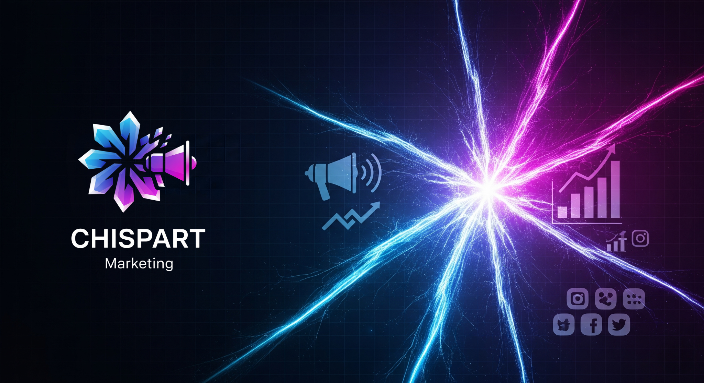
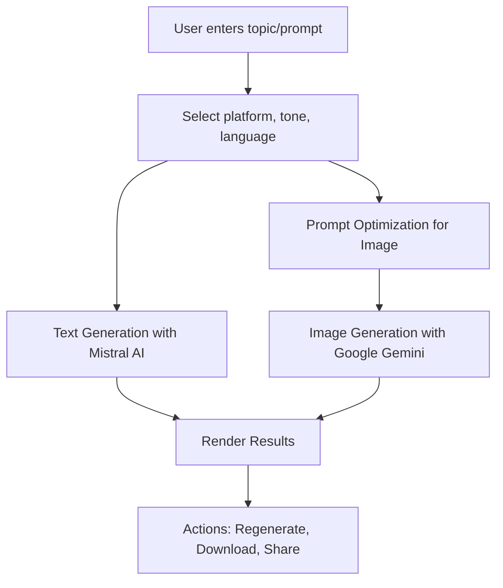

<p align="center">
  
</p>

# 🚀 CHISPART Marketing

<div class= align-flex>

[](https://nextjs.org/) [](https://www.typescriptlang.org/) [](https://tailwindcss.com/) [](https://mistral.ai/) [](https://deepmind.google/technologies/gemini/) [](LICENSE)

</div>

> **AI-powered marketing content generator for social media – Create texts and images with Mistral AI + Google Gemini**

---

## ✨ Features

- 📝 **AI Text Generation** – Create marketing copy tailored to platform, tone, and language.  
- 🎨 **AI Image Creation** – Generate unique visuals from text prompts or refine existing images.  
- 📱 **Multi-Platform** – Instagram, TikTok, LinkedIn, Facebook, X, and more.  
- 🌍 **Multilingual Support** – Supports Spanish, English, Chinese, Hindi, Arabic, French, etc.  
- 🎭 **Customizable Tone** – Match your brand voice.  
- 🖼️ **Platform-Specific Image Formats** – Ready-to-use for stories, posts, and headers.  
- 🎯 **Dual Image Generation** – Get two variations for refined prompts.  

---

## 🧩 Flow Diagram


    
## 🗂️ Project Structure

```
bash

src/
 ├─ app/page.tsx             # Main UI and logic
 ├─ ai/flows/                # AI integration logic
 │   ├─ generate-marketing-post.ts
 │   └─ generate-marketing-image.ts
 ├─ components/              # Reusable UI components
 ├─ hooks/                   # Custom hooks (useToast, etc.)
 ├─ lib/                     # Utility functions
public/                      # Static assets
tailwind.config.ts           # Tailwind configuration
next.config.js               # Next.js configuration
package.json                 # Dependencies and scripts
```

## ⚡ Installation

```
bash

git clone https://github.com/SebastianVernis/ChispartMarketingGen
cd chispart-marketing
npm install
```

# or

```
bash

git clone https://github.com/SebastianVernis/ChispartMarketingGen
cd chispart-marketing
yarn install
```

## 🔐 Environment Variables

Create a .env.local file:

```
env
MISTRAL_API_KEY=your_mistral_api_key
GEMINI_API_KEY=your_gemini_api_key
```

Run Locally

```
bash

npm run dev
```

# or

```
yarn dev
```

Visit http://localhost:3000

## ✅ Project Status
🔄 Current version: v1.0

## 🛠️ Next improvements: 

Post scheduling, prompt library, direct export.

## 👥 Contributing
Contributions are welcome!
Open an issue or submit a pull request.

## 📄 License
This project is licensed under the MIT License.

                                    
<div align= "center">
  <a text= "font-segoeui align-center strong">🔥 Desarrollado por Sebastian Vernis | Soluciones Digitales</a>
</div>
<div align= "center">
  <a href="https://sebastianvernis.com">Sebastian Vernis</a>
    <a> | </a>
  <a href="https://chispart.mx">Chispart</a>
</div>
    
<p align="center">
  
</p>
