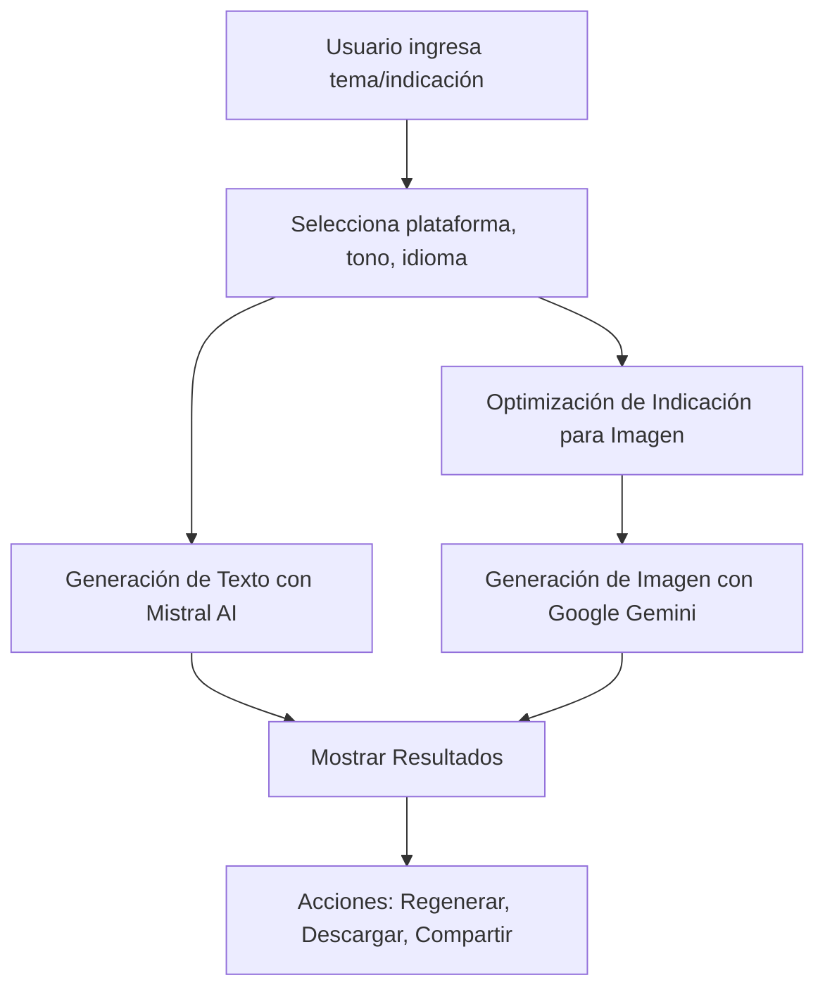
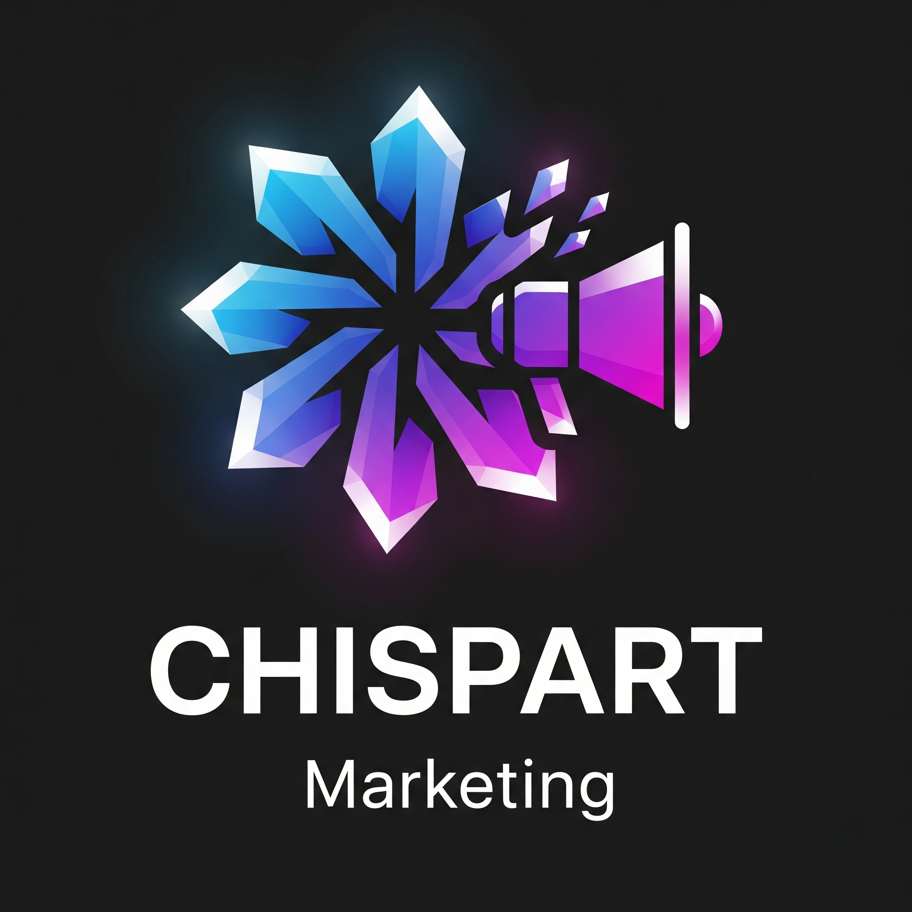

<p align= "center">
  


# Chispart Marketing🚀


> Generador de contenido de marketing impulsado por IA para redes sociales – Crea textos e imágenes con Mistral AI + Google Gemini
> 

---

## ✨ Características

- 📝 **Generación de Texto por IA** – Crea copias de marketing adaptadas a la plataforma, tono e idioma.
- 🎨 **Creación de Imágenes por IA** – Genera visuales únicos a partir de indicaciones de texto o refina imágenes existentes.
- 📱 **Multi-Plataforma** – Instagram, TikTok, LinkedIn, Facebook, X, y más.
- 🌍 **Soporte Multilingüe** – Compatible con español, inglés, chino, hindi, árabe, francés, etc.
- 🎭 **Tono Personalizable** – Coincide con la voz de tu marca.
- 🖼️ **Formatos de Imagen Específicos para Plataformas** – Listos para usar en historias, publicaciones y encabezados.
- 🎯 **Generación Dual de Imágenes** – Obtén dos variaciones para indicaciones refinadas.

---

## 🧩 Diagrama de Flujo



## 🗂️ Estructura del Proyecto

```
bash

src/
 ├─ app/page.tsx             # UI principal y lógica
 ├─ ai/flows/                # Lógica de integración de IA
 │   ├─ generate-marketing-post.ts
 │   └─ generate-marketing-image.ts
 ├─ components/              # Componentes UI reutilizables
 ├─ hooks/                   # Hooks personalizados (useToast, etc.)
 ├─ lib/                     # Funciones de utilidad
public/                      # Activos estáticos
tailwind.config.ts           # Configuración de Tailwind
next.config.js               # Configuración de Next.js
package.json                 # Dependencias y scripts

```

## ⚡ Instalación

```
bash

git clone <https://github.com/SebastianVernis/ChispartMarketingGen>
cd chispart-marketing
npm install

```

# o

```
bash

git clone <https://github.com/SebastianVernis/ChispartMarketingGen>
cd chispart-marketing
yarn install

```

## 🔐 Variables de Entorno

Crea un archivo .env.local:

```
env
MISTRAL_API_KEY=tu_clave_api_mistral
GEMINI_API_KEY=tu_clave_api_gemini

```

Ejecutar Localmente

```
bash

npm run dev

```

# o

```
yarn dev

```

Visita [http://localhost:3000](http://localhost:3000/)

## ✅ Estado del Proyecto

🔄 Versión actual: v1.0

## 🛠️ Próximas mejoras:

Programación de publicaciones, biblioteca de indicaciones, exportación directa.

## 👥 Contribuciones

¡Las contribuciones son bienvenidas!
Abre un problema o envía una solicitud de extracción.

## 📄 Licencia

Este proyecto está licenciado bajo la Licencia MIT.

---

<aside>

 **🔥 Desarrollado por Sebastian Vernis | Soluciones Digitales**                

[Sebastian Vernis](https://sebastianvernis.com) 🧑🏻‍💻 
[Chispart 🎨](https://chispart.mx)

</aside>

<p align="center">
  
</p>
